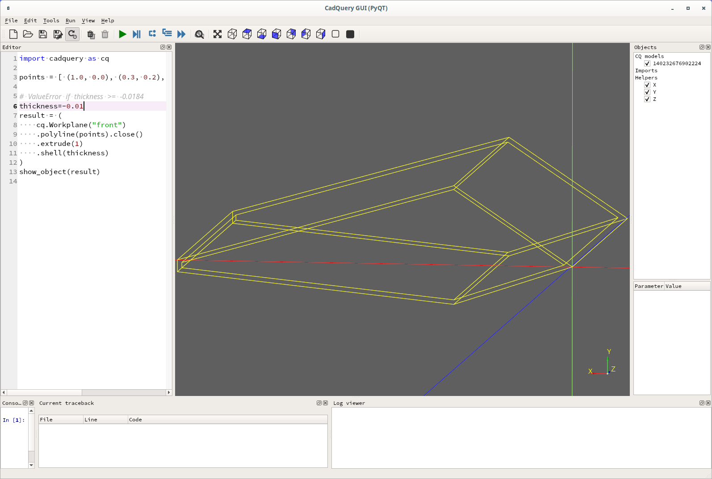
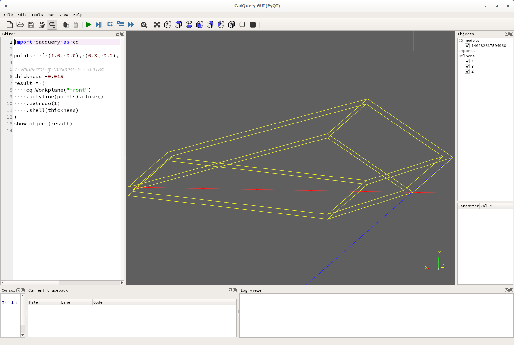
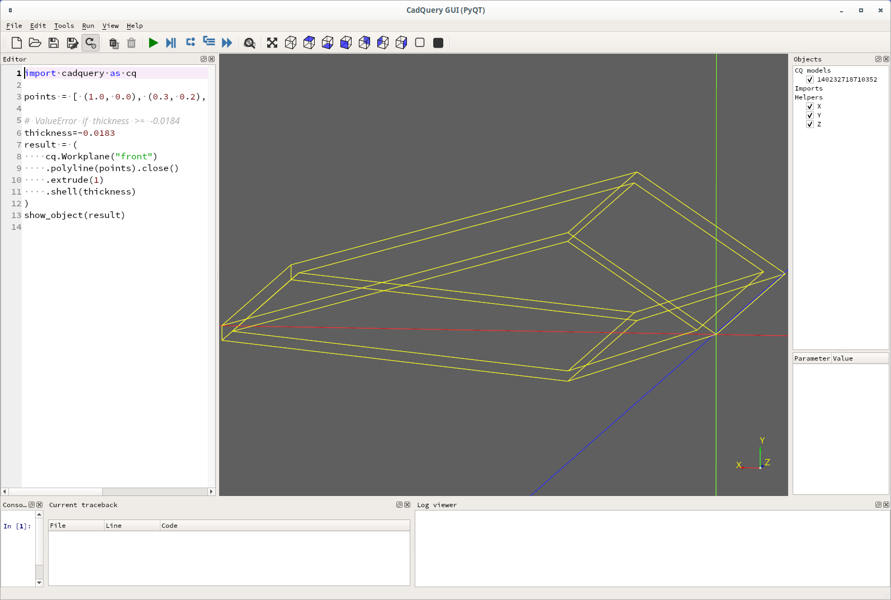
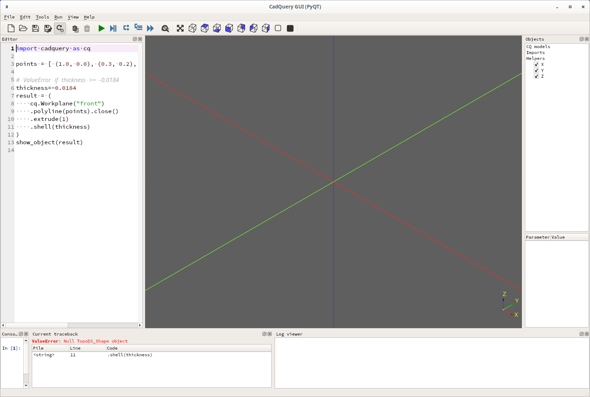
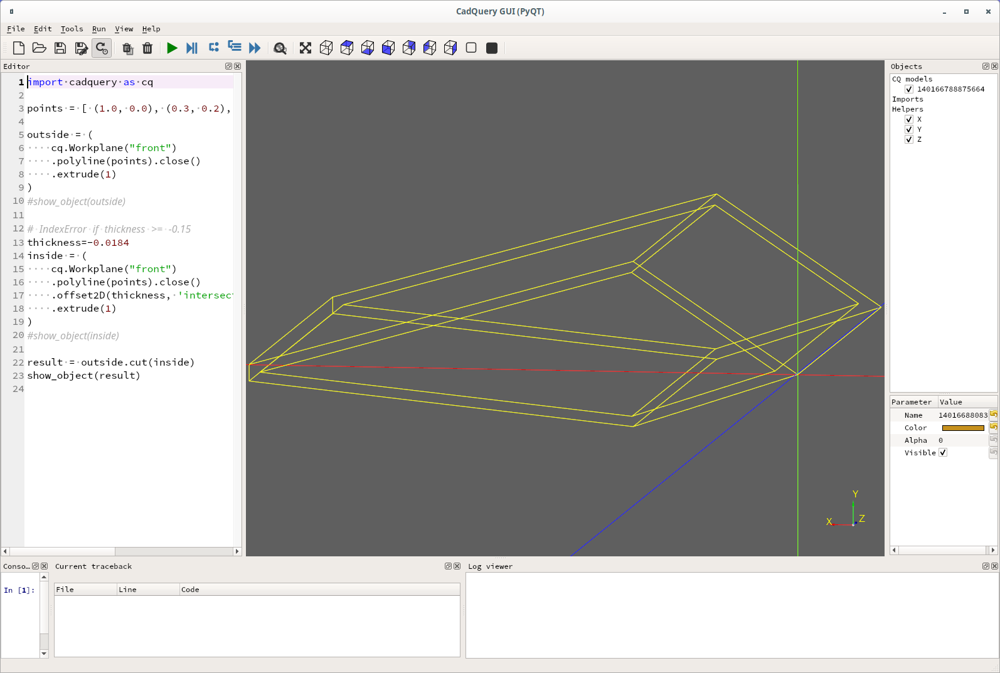
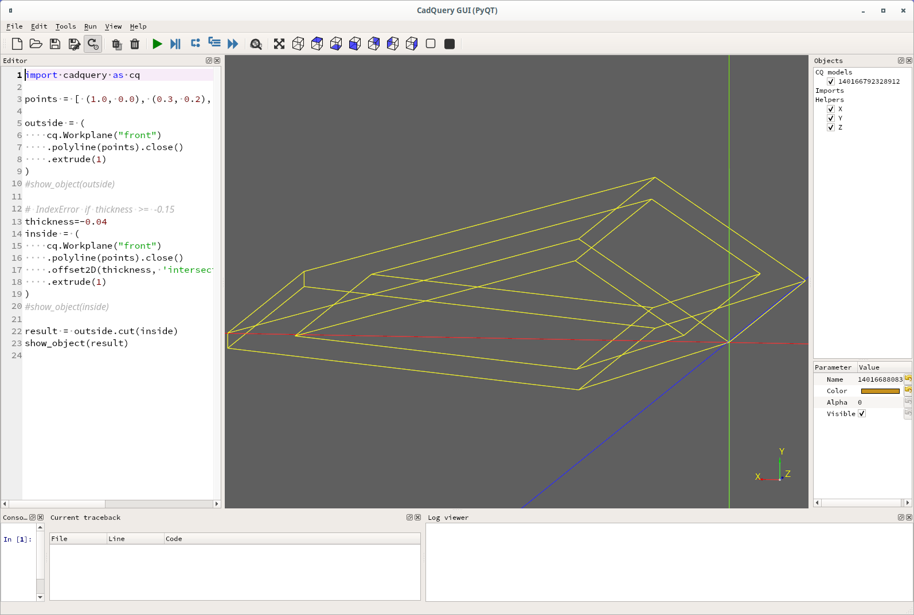
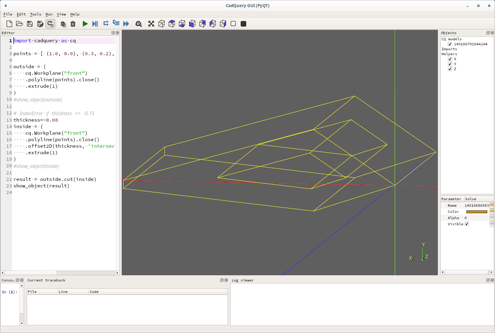
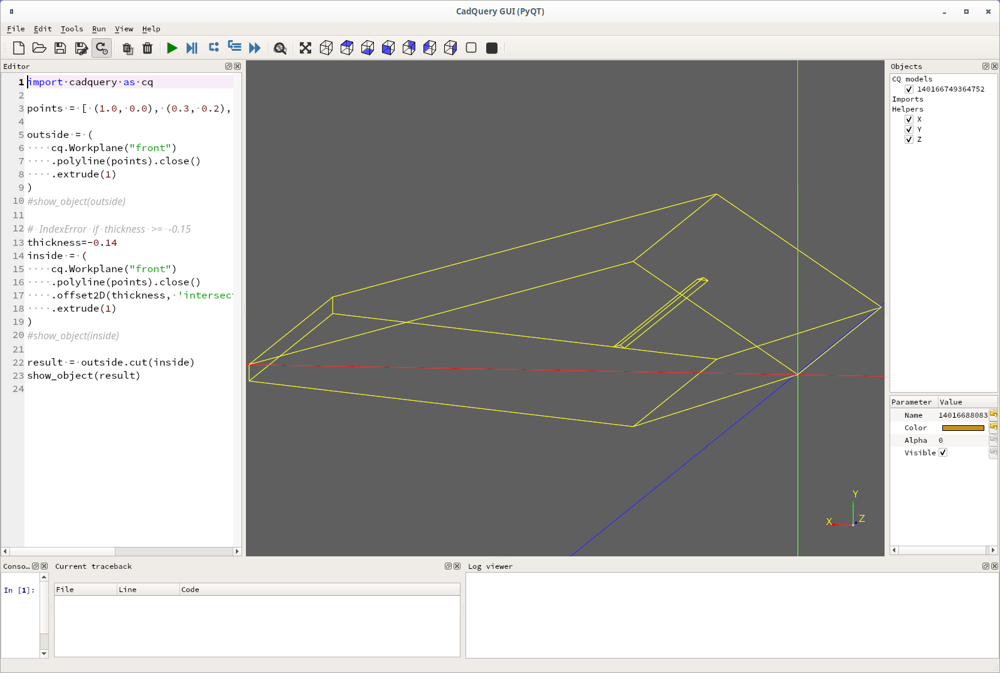
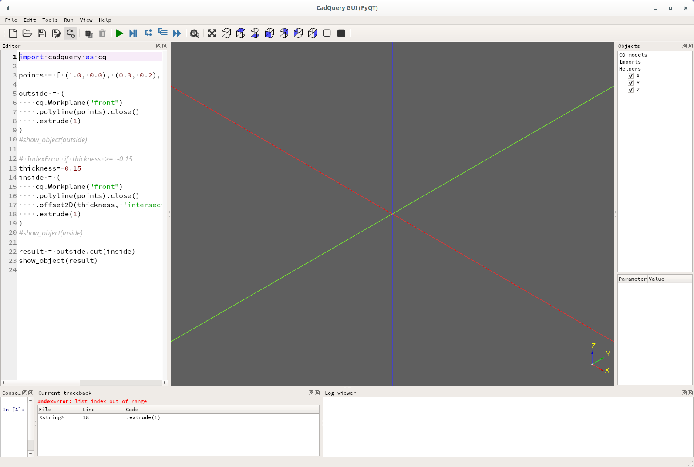

# Offset2D vs Shell

Compare `offset2D` and `shell`. Shell operates on 3D objects and creates
a "thin" wall with a hollow interior. You can also optionally remove
faces, so it is quite powerful.


But with a "complex" object a `ValueError` may occur if the wall is to thick.
My explanation for this is that if the number of vertices for the
"inner" object is not equal to the number of vertices in the outer object you
get a `ValueError`. So the thickness of the wall can be limited.

For example in the code below `shell` was OK at thickness <= -0.183
but a `ValueError` occurred at thickeness >= -0.0184
```
import cadquery as cq

points = [ (1.0, 0.0), (0.3, 0.2), (0.0, 0.0), (0.3, -0.1), (1.0, -0.03)]

# ValueError if thickness >= -0.01
thickness=-0.01
result = (
    cq.Workplane("front")
    .polyline(points).close()
    .extrude(1)
    .shell(thickness)
)
show_object(result)

```






But, with `offset2D` the following code, using exactly the same
set of points, works until the thickness is -0.15. At that point
it fails with an `IndexError` because the object is no longer hollow.

So, although harder to use `offset2D` maybe usable in situations
where `shell` fails:
```
import cadquery as cq

points = [ (1.0, 0.0), (0.3, 0.2), (0.0, 0.0), (0.3, -0.1), (1.0, -0.03)]

outside = (
    cq.Workplane("front")
    .polyline(points).close()
    .extrude(1)
)
#show_object(outside)

# IndexError if thickness >= -0.15
thickness=-0.01
inside = (
    cq.Workplane("front")
    .polyline(points).close()
    .offset2D(thickness, 'intersection')
    .extrude(1)
)
#show_object(inside)

result = outside.cut(inside)
show_object(result)

```







